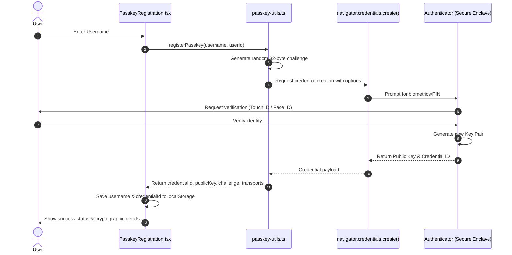
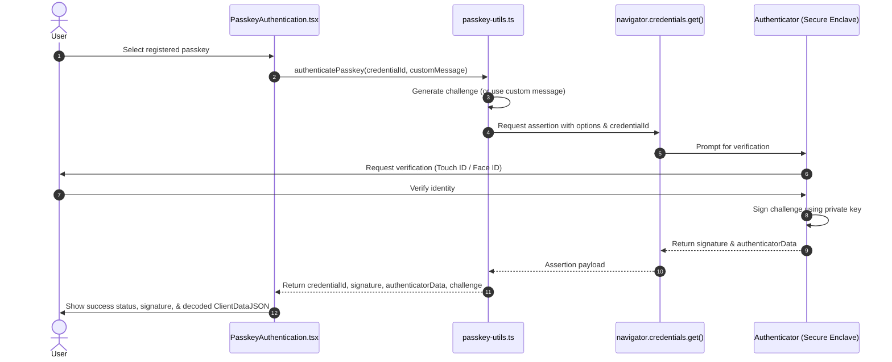

# Passkey Demo App 🔐

**[Try it out here](https://noble-8.github.io/passkeys/)**

A modern React application demonstrating Web Authentication API (WebAuthn) for passwordless authentication using passkeys. This app showcases how to register and authenticate users using biometric authentication, Touch ID, Face ID, and Windows Hello.

## Features

- ✅ **Passkey Registration** - Create new passkeys with custom usernames and device names
- ✅ **Passkey Authentication** - Authenticate using registered passkeys
- ✅ **Local Storage** - All data stored locally in browser (no database required)
- ✅ **Modern UI** - Clean, responsive interface built with React and Tailwind CSS
- ✅ **Security Demo** - Cryptographic signature generation and verification demonstration
- ✅ **Cross-Platform** - Works on desktop and mobile devices

## How It Works

### 🔐 Passkey Registration Process



#### Step 1: User Input
- User enters a **username** and optional **device name**
- App generates a unique **user ID** using `crypto.randomUUID()`

#### Step 2: WebAuthn Registration Setup
The app calls `registerPasskey(username, userId)` which:

1. **Generates a random challenge** (32 bytes) using `crypto.getRandomValues()`
2. **Creates registration options** with:
   - `challenge`: Random data to prevent replay attacks
   - `rp` (Relying Party): App name and domain
   - `user`: User info (ID, name, display name)
   - `pubKeyCredParams`: Supported algorithms (ES256, RS256)

#### Step 3: Browser/Device Interaction
```javascript
const credential = await navigator.credentials.create({
  publicKey: publicKeyCredentialCreationOptions,
}) as PublicKeyCredential;
```

This triggers:
- **Platform prompt** (Touch ID, Face ID, Windows Hello, etc.)
- **User verification** (biometric or PIN)
- **Key pair generation** on the device's secure enclave
- **Private key** stays on device (never leaves)
- **Public key** is returned to the app

#### Step 4: Data Processing
The response contains:
- `credentialId`: Unique identifier for this passkey
- `publicKey`: The public key (base64url encoded)
- `challenge`: The original challenge
- `transports`: Supported connection methods (USB, NFC, BLE, internal)

#### Step 5: Local Storage
```javascript
// Store in localStorage (without public key for security)
const storedPasskeys = JSON.parse(localStorage.getItem('passkeys') || '[]');
storedPasskeys.push({
  userId,
  username,
  credentialId: passkey.credentialId,
  transports: passkey.transports,
  deviceName: deviceName || 'Passkey Device',
  createdAt: new Date().toISOString(),
});
```

### 🛡️ Passkey Authentication Process



#### Step 1: Load Available Passkeys
- App reads from `localStorage` to get registered passkeys
- Displays them as clickable options

#### Step 2: User Selection
- User clicks on a passkey to authenticate
- App calls `authenticatePasskey(credentialId)`

#### Step 3: WebAuthn Authentication Setup
The app:

1. **Generates a new random challenge** (32 bytes)
2. **Creates authentication options** with:
   - `challenge`: New random data
   - `allowCredentials`: The specific credential ID to use
   - `timeout`: 60 seconds
   - `userVerification`: Required (biometric/PIN)

#### Step 4: Browser/Device Interaction
```javascript
const credential = await navigator.credentials.get({
  publicKey: publicKeyCredentialRequestOptions,
}) as PublicKeyCredential;
```

This triggers:
- **Platform prompt** for user verification
- **Private key** signs the challenge
- **Signature** is returned (proves possession of private key)

#### Step 5: Authentication Data
The response contains:
- `credentialId`: Confirms which passkey was used
- `challenge`: The challenge that was signed
- `authenticatorData`: Device-specific data
- `signature`: Cryptographic proof of authentication
- `userHandle`: User ID (if available)

## 🔒 Security Features

### What Makes This Secure:

1. **Private Key Never Leaves Device**
   - Private key is generated and stored in secure hardware
   - Never transmitted over network

2. **Challenge-Response Protocol**
   - Each authentication uses a unique random challenge
   - Prevents replay attacks

3. **Cryptographic Signatures**
   - Public key verifies signatures
   - Proves possession of private key

4. **User Verification Required**
   - Biometric or PIN required for each use
   - Prevents unauthorized access if device is stolen

### Data Flow Summary:

**Registration:**
```
User Input → Generate Challenge → WebAuthn Create → Device Generates Key Pair → 
Store Public Key + Credential ID → Save to localStorage
```

**Authentication:**
```
Select Passkey → Generate Challenge → WebAuthn Get → Device Signs Challenge → 
Return Signature → Verify Authentication
```

## 🚀 Getting Started

### Prerequisites

- Node.js 18+ 
- Modern browser with WebAuthn support
- Device with biometric authentication (Touch ID, Face ID, Windows Hello, etc.)

### Installation

1. **Clone the repository**
   ```bash
   git clone <repository-url>
   cd passkeys
   ```

2. **Install dependencies**
   ```bash
   npm install
   ```

3. **Start the development server**
   ```bash
   npm run dev
   ```

4. **Open your browser**
   Navigate to `http://localhost:5173`

### Building for Production

```bash
npm run build
```

## 🛠️ Technology Stack

- **React 18** - UI framework
- **TypeScript** - Type safety
- **Vite** - Build tool and dev server
- **Tailwind CSS** - Styling
- **WebAuthn API** - Passkey functionality
- **Lucide React** - Icons

## 📱 Browser Support

This app requires a modern browser with WebAuthn support:

- ✅ Chrome 67+
- ✅ Firefox 60+
- ✅ Safari 14+
- ✅ Edge 79+

## 🔧 Project Structure

```
src/
├── components/
│   ├── PasskeyAuthentication.tsx  # Authentication component
│   └── PasskeyRegistration.tsx    # Registration component
├── lib/
│   └── passkey-utils.ts          # WebAuthn utility functions
├── App.tsx                        # Main app component
└── main.tsx                       # App entry point
```

## 🎯 Key Components

### PasskeyRegistration
- Handles passkey creation
- Manages user input and form validation
- Stores passkey data in localStorage
- Displays registration parameters including challenge, public key, and credential ID

### PasskeyAuthentication
- Lists available passkeys
- Handles authentication flow
- Displays authentication results

### passkey-utils.ts
- `registerPasskey()` - Creates new passkeys
- `authenticatePasskey()` - Authenticates with existing passkeys
- `generateRandomChallenge()` - Creates secure random challenges
- Base64url encoding/decoding utilities

## 🔍 Understanding the Code

### Registration Flow
1. User submits form with username and device name
2. App generates unique user ID
3. WebAuthn creates credential with challenge
4. Device generates key pair (private key stays on device)
5. Public key and credential ID are stored locally

### Authentication Flow
1. App loads registered passkeys from localStorage
2. User selects a passkey to authenticate with
3. WebAuthn requests authentication with new challenge
4. Device signs challenge with private key
5. App receives signature as proof of authentication

## 🚨 Important Notes

- **HTTPS Required**: WebAuthn only works over HTTPS (or localhost)
- **Local Storage**: All data is stored in browser's localStorage
- **No Server**: This is a client-side only demo
- **Security**: Private keys never leave the user's device

## 🤝 Contributing

1. Fork the repository
2. Create a feature branch
3. Make your changes
4. Test thoroughly
5. Submit a pull request

## 📄 License

This project is open source and available under the [MIT License](LICENSE).

## 🙏 Acknowledgments

- WebAuthn specification and working group
- React and Vite teams
- Tailwind CSS for the styling framework
- All contributors to the open source ecosystem

---

**Built with ❤️ to demonstrate the power of passwordless authentication**
